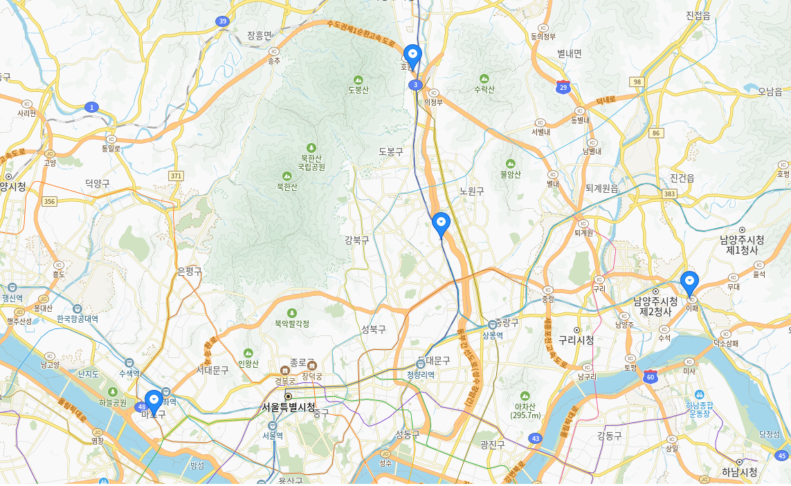

<h1 align ="center">  중간 지점 계산기 </h1>

<h2> Abstract </h2>

 
서울 내에서 각 인원들의 중간 지점 중 어느 역에서 만날지 계산해서 출력해주는 프로젝트입니다.  
총 인원수를 입력받고, 각 인원들의 위치를 찍어서 해당 인원들의 중간 지점에서 가장 가까운 지하철역을 계산합니다.  
그 후에는 최종적으로 각 인원별로 목적지까지 가는 노선도를 알려줍니다.  

<h2 style = "margin-top:70px;"> Project schedule </h2>

| 활동            | 시작         | 종료         | 설명 |
|----------------|-------------|-------------|------|
| 프로젝트 시작   | 2024-11-13  |             |      |
| 1 주차         | 2024-11-13  | 2024-11-19  | API를 이용해 지도에서 찍은 위치의 값을 가져와서 저장하는 코드 구현 |
| 2 주차         | 2024-11-20  | 2024-11-26  | 1주차에서의 정보를 원하는 인원수 만큼 얻을 수 있도록 구현 |
| 3 주차         | 2024-11-27  | 2024-12-03  | 각 위치의 중간 위치를 구하여 저장하도록 구현 |
| 4 주차         | 2024-12-04  | 2024-12-10  | API를 이용해 중간 위치에서 가장 가까운 역을 출력하도록 구현 |
| 5 주차         | 2024-12-11  | 2024-12-16  | GUI 개선 및 최종 테스트 |
| 프로젝트 종료   | 2024-12-17  |             |      |

<h2 style = "margin-top:100px;"> Team roles & development areas </h2>

 
2020202072 김주영 : 주택 및 역 위치 데이터 수집  
2020202076 임현석 : 중간지점 계산 알고리즘 구현  
2020202022 최정현 : 메인 입력 페이지 구현  
2021202076 최유완 : 출력 페이지 구현 

<h2 style = "margin-top:100px;"> List of technologies required </h2>

 

 
카카오 개발자 지도 API 

